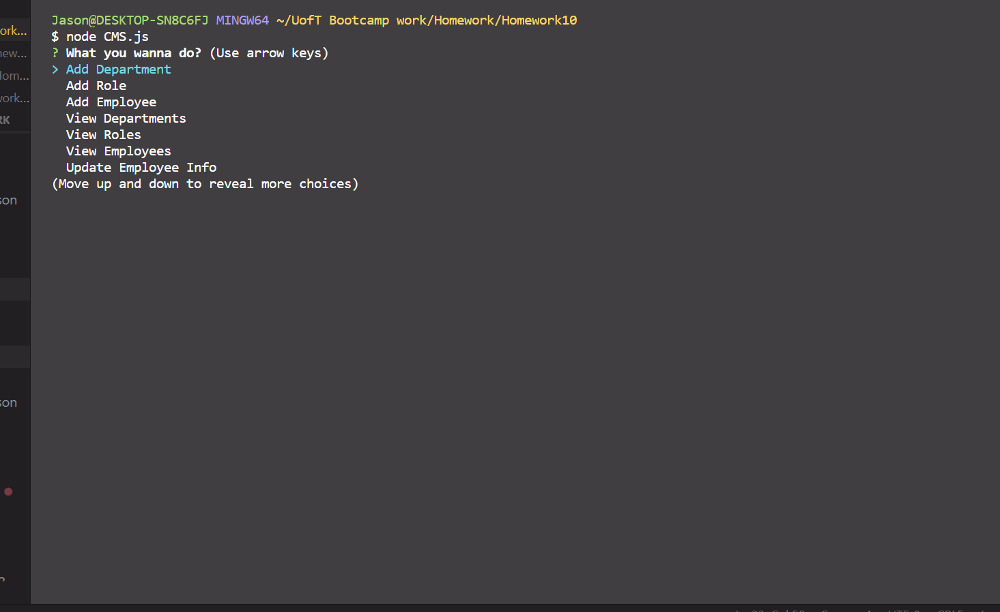

Content Management System

This application allows a user to add, view, update and delete company details such as Departments, Roles and Employees. Starting the CMS, users can:

    - addDepartment,
    - addRole,
    - addEmployee,
    - viewDepartments,
    - viewRoles,
    - viewEmployees,
    - updateEmployeeInfo,
    - deleteEmployee,

Adding Departments, Roles, Employees:

Inquirer asks user details about the respective section, and then adds the info to the database. If the user creates an employee with the role manager, the info is added to the manager table instead.

View Functions:

Console the tables with the respective information

Udate Employee Info:

Allows user to update an employees role or manager. Usuing inquirer list, the suer can select an exisitng employee. Then they can choose to either update the employees role or manager. 

If the user selects role they can either choose an existing role or create a new role. Creating a new role will add this role to the roles table in the database as well as udpate the employees table.

Similarly, if the user selects manager, they can either select an exisitng manager or create a new manager. Creating a new Manager will add them to the managers table and update the employees table.

DeleteEmployee: 

This prompts a user to select whether they wish to delete an Employee or manager. They are then provided with a list of existing employees or managers which they can select from to delete that worker.